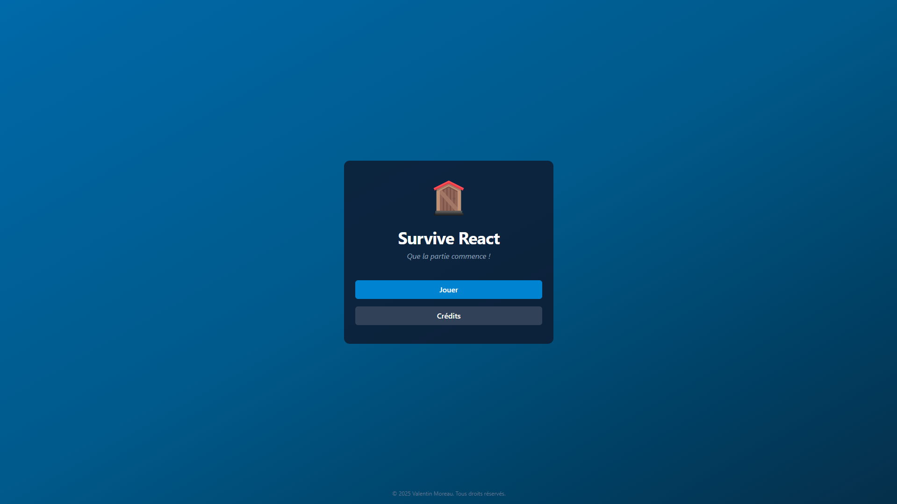
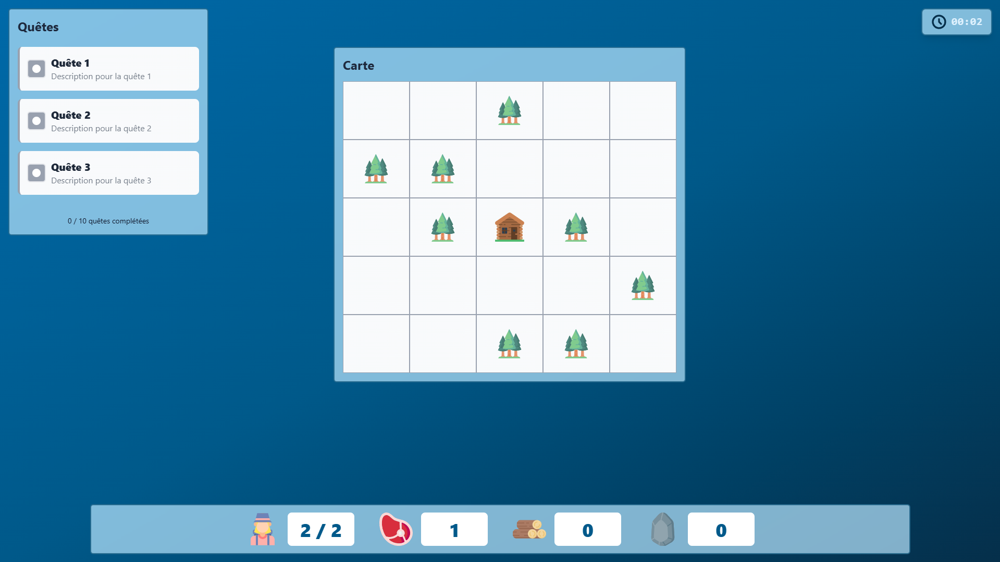

# Survive React 🏠🌲

**Survive React** est un mini jeu de gestion de ressources développé en React.

## 🎮 À propos du jeu

**Survive React** est un mini jeu de gestion de ressources où vous contrôlez une colonie de survivants. Votre objectif est de récolter des ressources, construire des maisons et maintenir vos survivants en vie le plus longtemps possible.

### Fonctionnalités principales

- 🏗️ **Construction** : Construisez des maisons pour augmenter votre capacité de survivants
- 🌲 **Récolte** : Envoyez vos survivants récolter du bois et de la nourriture dans les forêts
- 🥩 **Gestion des ressources** : Gérez la nourriture pour maintenir vos survivants en vie
- ⏱️ **Système de temps** : Le temps s'écoule et vos survivants consomment de la nourriture régulièrement
- 🎯 **Système de quêtes** : (Système fictif)
- 🗺️ **Carte interactive** : Grille 5x5 avec différents types de terrains

## 🚀 Installation et lancement

### Prérequis

- Node.js (version 16 ou supérieure)
- npm ou yarn

### Installation

1. Clonez le repository :

```bash
git clone https://github.com/votre-username/survive-react.git
cd survive-react
```

2. Installez les dépendances :

```bash
npm install
```

3. Lancez le serveur de développement :

```bash
npm run dev
```

### Script disponibles

- `npm run dev` : Lance le serveur de développement
- `npm run build` : Construit l'application pour la production
- `npm run preview` : Affiche une prévisualisation de la production
- `npm run lint` : Vérifie le code avec ESLint

## 🎯 Comment jouer

### Règle de base

1. **Survivants** : Vous commencez avec 2 survivants
2. **Nourriture** : Vos survivant consomment 1 unité de nourriture toutes les 10 secondes
3. **Construction** : Cliquez sur une case pour construire une maison avec 5 de bois (+2 survivants)
4. **Récolte** : Cliquez sur une forêt pour envoyer un survivant récolter (5 secondes)
5. **Game Over** : Le jeu se termine quand tous vos survivant meurent de faim

### Ressources

- 🧑‍🤝‍🧑 **Survivants** : Votre main-d'œuvre pour la récolte
- 🥩 **Nourriture** : Nécessaire pour maintenir vos survivants en vie
- 🪵 **Bois** : Utilisé pour construire des maisons
- 🪨 **Pierre** : Ressource future (non implémentée)

## 🛠️ Technologies utilisées

- **React** : Bibliothèque JavaScript
- **Vite** : Outil de build rapide
- **Tailwind CSS v4** : Framework CSS utilitaire
- **ESLint** : Linter pour la qualité du code

## 🎨 Captures d'écran




